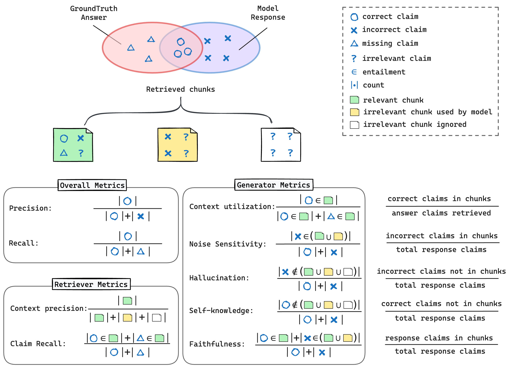

# RAGChecker: A Fine-grained Framework For Diagnosing RAG

RAGChecker is an advanced automatic evaluation framework designed to assess and diagnose Retrieval-Augmented Generation (RAG) systems. It provides a comprehensive suite of metrics and tools for in-depth analysis of RAG performance.

<p align="center">
  
  <br>
  <b>Figure</b>: RefChecker Metrics
</p>

## 🌟 Highlighted Features

- **Holistic Evaluation**: RAGChecker offers `Overall Metrics` for an assessment of the entire RAG pipeline.

- **Diagnostic Metrics**: `Diagnostic Retriever Metrics` for analyzing the retrieval component. `Diagnostic Generator Metrics` for evaluating the generation component. These metrics provide valuable insights for targeted improvements.

- **Fine-grained Evaluation**: Utilizes `claim-level entailment` operations for fine-grained evaluation.

- **Benchmark Dataset**: A comprehensive RAG benchmark dataset with 4k questions covering 10 domains (upcoming).

- **Meta-Evaluation**: A human-annotated preference dataset for evaluating the correlations of RAGChecker's results with human judgments.

RAGChecker empowers developers and researchers to thoroughly evaluate, diagnose, and enhance their RAG systems with precision and depth.


## 🚀 Quick Start

### Setup Environment

```bash
pip install refchecker
python -m spacy download en_core_web_sm
pip install -r requirements
```


### Run the Checking Pipeline

We have put an example file in the [examples](./examples) folder. Please process your own data with the same format in [examples/checking_inputs.json](./examples/checking_inputs.json). 

If you are using AWS Bedrock version of Llama3 70B for the claim extractor and checker, use the following command to run the checking pipeline, the checking results will be saved to `--output_path`:


```bash
python ragchecker/checking.py \
    --input_path=examples/checking_inputs.json \
    --output_path=examples/checking_outputs.json \
    --extractor_name=bedrock/meta.llama3-70b-instruct-v1:0 \
    --checker_name=bedrock/meta.llama3-70b-instruct-v1:0 \
    --batch_size_extractor=64 \
    --batch_size_checker=64 \
    --answer2response \
    --response2answer \
    --retrieved2response \
    --retrieved2answer
```


### Computing Metrics

Use the following command for computing the metrics:

```bash
python ragchecker/rag_eval.py --file=examples/checking_outputs.json
```

It will output the values for the metrics like follows:

```json
Results for examples/checking_outputs.json:
{
  "overall_metrics": {
    "precision": 73.3,
    "recall": 62.5,
    "f1": 67.5
  },
  "retriever_metrics": {
    "claim_recall": 61.4,
    "context_precision": 87.5
  },
  "generator_metrics": {
    "context_utilization": 87.5,
    "noise_sensitivity_in_relevant": 22.5,
    "noise_sensitivity_in_irrelevant": 0.0,
    "hallucination": 4.2,
    "self_knowledge": 25.0,
    "faithfulness": 70.8,
    "claim_count": 8,
    "response_acc": 0.0
  }
}
```

## Meta Evaluation


## Security

See [CONTRIBUTING](CONTRIBUTING.md#security-issue-notifications) for more information.

## License

This project is licensed under the Apache-2.0 License.

