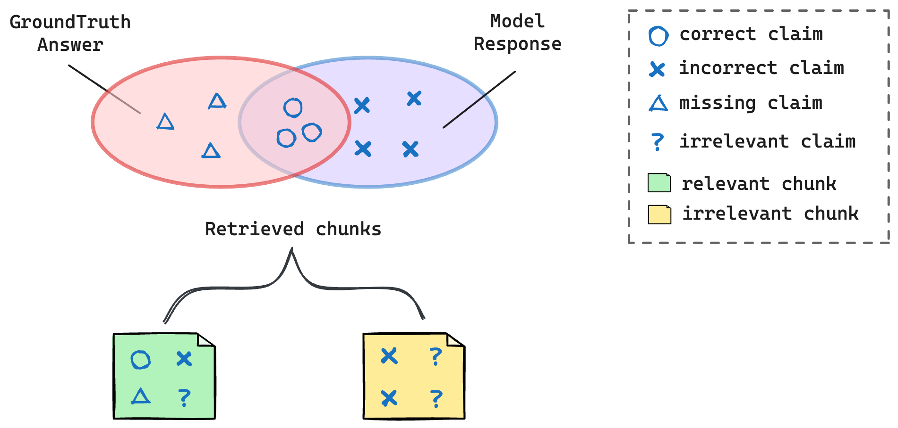
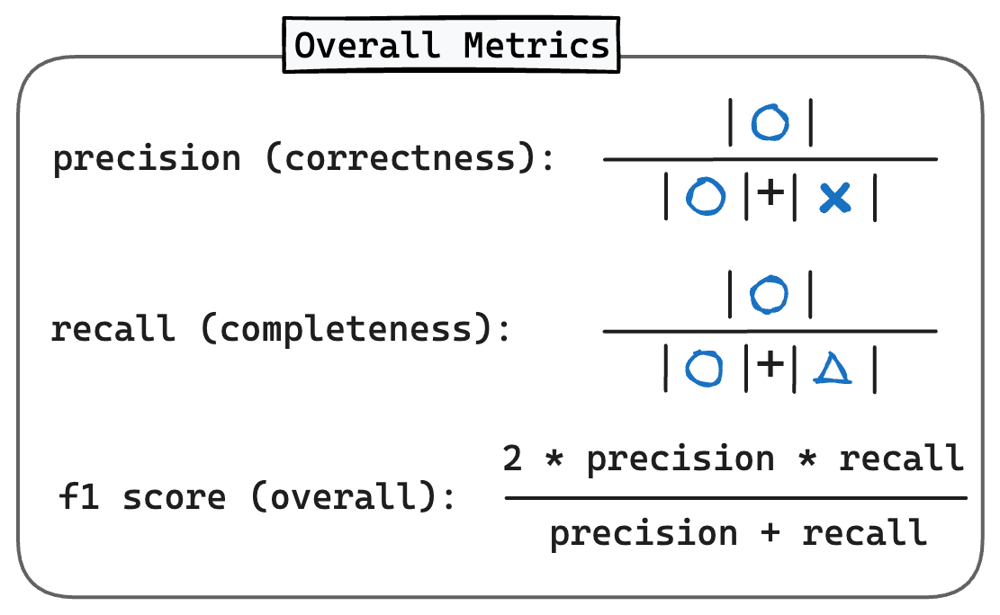
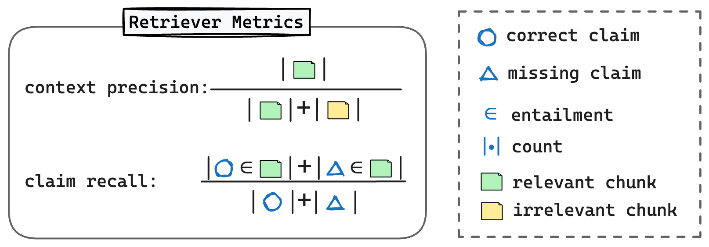

# RAGChecker Tutorial

Table of Contents:

- [Introduction to RAGChecker](#introduction-to-ragchecker)
- [Prepare the Benchmark Data and RAG Outputs](#prepare-the-benchmark-data-and-rag-outputs)
   - [Benchmark Dataset](#benchmark-dataset)
   - [Outputs from RAG](#outputs-from-rag)
- [How RAGChecker Works](#how-ragchecker-works)
- [RAGChecker Metrics](#ragchecker-metrics)
   - [Overall Metrics](#overall-metrics)
   - [Retriever Metrics](#retriever-metrics)
   - [Generator Metrics](#generator-metrics)
   - [Summary of RAGChecker Metrics](#summary-of-ragchecker-metrics)
- [How to Use RAGChecker](#how-to-use-ragchecker)
   - [Command Line Method](#command-line-method)
   - [Embedding in Python Code](#embedding-in-python-code)
- [Interpreting Results and Improving Your RAG System](#interpreting-results-and-improving-your-rag-system)
- [FAQ](#faq)

## Introduction to RAGChecker


RAGChecker is a comprehensive evaluation framework designed to assess and diagnose Retrieval-Augmented Generation (RAG) systems. RAG systems combine a retriever, which fetches relevant information from a knowledge base, and a generator, which produces responses based on the retrieved information and the input query.

RAGChecker helps developers:

- Identify specific areas of improvement in their RAG systems.
- Understand the interplay between retrieval and generation components.
- Improve their systems for better performance and reliability.

## Prepare the Benchmark Data and RAG Outputs

<p align="center">
  
  <br>
  <b>Figure</b>: RAG Pipeline
</p>

#### Benchmark Dataset

To use RAGChecker, you need to prepare a `benchmark dataset` or test set, consisting of question-answer (QA) pairs:
- **Question**: The real-world question or query that a user might input to the RAG system.
- **Ground Truth Answer (GT Answer)**: The ideal answer to the question, typically written by humans based on available documents.

Normally, the questions are collected from real-world user cases. Put the QA pairs into a `JSON` file with the following format:

```json
{
   "results": [ # A list of QA pairs
      {
         "query_id": "000",
         "query": "This is the question for the first example",
         "gt_answer": "This is the ground truth answer for the first example"
      },
      {
         "query_id": "001",
         "query": "This is the question for the second example",
         "gt_answer": "This is the ground truth answer for the second example"
      },
      ...
   ]
}
```


#### Outputs from RAG

For each question in your benchmark, run your RAG system and collect:
- **Retrieved Context**: A list of text chunks retrieved from the knowledge base for the given question.
- **Response**: The final output generated by your RAG system based on the question and retrieved context.

Add these outputs to your JSON file:

```json
{
   "results": [
      {
         "query_id": "000",
         "query": "This is the question for the first example",
         "gt_answer": "This is the ground truth answer for the first example",
         "response": "This is the RAG response for the first example",
         "retrieved_context": [ # A list of chunks returned from the retriever and used for response generation
            {
               "doc_id": "xxx",
               "text": "Content of the first chunk"
            },
            {
               "doc_id": "xxx",
               "text": "Content of the second chunk"
            },
            ...
         ]
      },
      {
         "query_id": "001",
         "query": "This is the question for the second example",
         "gt_answer": "This is the ground truth answer for the second example",
         "response": "This is the RAG response for the second example",
         "retrieved_context": [
            {
               "doc_id": "xxx",
               "text": "Content of the first chunk"
            },
            {
               "doc_id": "xxx",
               "text": "Content of the second chunk"
            },
            ...
         ]
      }
   ],
   ...
}
```


## How RAGChecker Works

RAGChecker uses a `claim-level checking` approach for fine-grained evaluation. Here's how it works:

1. **Claim Extraction**:RAGChecker uses a large language model (LLM) as an extractor to break down complex texts (RAG system responses and ground truth answers) into individual claims. A claim is a standalone, atomic piece of information that can be verified as true or false.
Example:
Text: "The Eiffel Tower, built in 1889, is 324 meters tall."
Extracted claims:
```
("Eiffel Tower", "built in", "1889")
("Eiffel Tower", "height", "324 meters")
```

2. **Claim Checking**: Another LLM acts as a checker to verify the accuracy of each extracted claim against reference texts (either the retrieved context or the ground truth answer).

<p align="center">
  
  <br>
  <b>Figure</b>: Claim-level Checking
</p>

RAGChecker performs the following comparisons:

- Response claims vs. GT Answer: Measures correctness of the response
- GT Answer claims vs. Response: Measures completeness of the response
- Response claims vs. Retrieved Context: Measures faithfulness and identifies hallucinations
- GT Answer claims vs. Retrieved Context: Evaluates the quality of retrieved information

These comparisons form the basis for RAGChecker's comprehensive metrics.


## RAGChecker Metrics

RAGChecker provides three categories of metrics to evaluate different aspects of a RAG system:

#### Overall Metrics

<p align="center">
  
  <br>
  <b>Figure</b>: Overall Metrics
</p>

These metrics measure the end-to-end quality of the entire RAG pipeline:

- **Precision**: Indicates the `correctness` of the response(proportion of correct claims in the response).
- **Recall**: Indicates the `completeness` of the response(proportion of ground truth claims mentioned in the response).
- **F1 Score**: The harmonic mean of precision and recall, providing an overall quality score.

The computation of the overall metrics requires `response` and `GT answer`, no need for `retrieved context`.

### Retriever Metrics

<p align="center">
  
  <br>
  <b>Figure</b>: Retriever Metrics
</p>

The retriever metrics measure the retriever's (e.g. BM25) ability to find relevant information and reduce noise.

- **Claim Recall**: Proportion of ground truth claims covered by retrieved chunks.
- **Context Precision**: Proportion of relevant chunks. The irrelevant chunks can be considered as noise.

> Relevant chunk is the one that contains any of the claims in GT answer (green squares in the figure).

The computation of retriever metrics requires `GT answer` and `retrieved context`.

### Generator Metrics

<p align="center">
  
  <br>
  <b>Figure</b>: Generator Metrics
</p>

These metrics evaluate various aspects of the generator's performance:

- **Context Utilization**: How effectively the generator uses relevant information from the context.
- **Noise Sensitivity**: How much the generator is influenced by noise in relevant and irrelevant chunks.
- **Hallucination**: Incorrect information generated that's not in the context.
- **Self-knowledge**: Use of the model's own knowledge instead of the context.
- **Faithfulness**: How well the generator sticks to the retrieved context.


### Summary of RAGChecker Metrics

| Module | Metric | Description | Note |
| --     | --     | --          | -- |
| Overall | Precision | Correctness of the response |  |
|         | Recall | Completeness of the response |  |
|         | F1 | Overall quality of the response |  |
| Retriever | Claim Recall | Claim-level recall by the retrieved context|   |
|           | Context Precision | Portion of relevant chunks in retrieved context |  |
| Generator | Context Utilization | How effectively the generator uses relevant information in the context |  |
|           | Noise Sensitivity in Relevant | How much the generator influenced by noise in `relevant chunks` | The lower the better |
|           | Noise Sensitivity in Irrelevant | How much the generator influenced by noise in `irrelevant chunks` | The lower the better |
|           | Hallucination | Incorrect information made up by the generator | The lower the better |
|           | Self-knowledge | Use of the model's own knowledge instead of the context | Whether it is lower the better depends on user's preference |
|           | Faithfulness | How well the generator sticks to the retrieved context |  |


## How to Use RAGChecker

First install dependencies:

```bash
pip install ragchecker
python -m spacy download en_core_web_sm
```


### Command Line Method

1. Prepare your input JSON file with the required format (see descriptions above).

2. Run the evaluation script (using example file in our repo):
```bash
ragchecker-cli \
    --input_path=examples/checking_inputs.json \ # This is your input data with required format
    --output_path=examples/checking_outputs.json \ # You will specify an output file here
    --extractor_name=bedrock/meta.llama3-1-70b-instruct-v1:0 \ # See description below on how to setup this
    --checker_name=bedrock/meta.llama3-1-70b-instruct-v1:0 \ # See description below on how to setup this
    --batch_size_extractor=64 \
    --batch_size_checker=128 \ # Can be larger than batch_size_extractor
    --metrics all_metrics # all_metrics, overall_metrics, retriever_metrics or generator_metrics
```

> 💡 **Notes on setting up LLM for extractor and checker**
> 
> RAGChecker employ [litellm](https://docs.litellm.ai/) for invoking the LLMs. Please refer to their documentation for different LLM providers(e.g. OpenAI, AWS Bedrock, AWS Sagemaker, or deployed by vllm): [Supported Model & Providers](https://docs.litellm.ai/docs/providers). 
>
> You can also refer to [RefChecker's guidance](https://github.com/amazon-science/RefChecker/tree/main?tab=readme-ov-file#choose-models-for-the-extractor-and-checker) for setting up the LLMs.

### Embedding in Python Code

```python
from ragchecker import RAGResults, RAGChecker
from ragchecker.metrics import all_metrics


# initialize ragresults from json/dict
with open("examples/checking_inputs.json") as fp:
    rag_results = RAGResults.from_json(fp.read())

# set-up the evaluator
evaluator = RAGChecker(
    extractor_name="bedrock/meta.llama3-1-70b-instruct-v1:0",
    checker_name="bedrock/meta.llama3-1-70b-instruct-v1:0",
    batch_size_extractor=32,
    batch_size_checker=32
)

# evaluate results with selected metrics or certain groups, e.g., retriever_metrics, generator_metrics, all_metrics
evaluator.evaluate(rag_results, all_metrics)
print(rag_results)
```

> 💡 **Use Your Own LLMs for Extraction and Checking**
> 
> As described above, we use litellm for invoking LLMs for claim extraction and checking. But, sometimes we want to use LLM deployed by our own which is not compatiable with litellm, we can use parameter `custom_llm_api_func` to setup the function for invoking our LLM. 
>
>```python
># define the function for invoking your own LLM
>def my_llm_api_func(prompts):
>    """
>    Get responses from LLM for the input prompts
>    Parameters
>    ----------
>    prompts: List[str]
>    A list of prompts.
>    
>    Returns
>    ----------
>    response_list : List[str]
>        A list of generated text.
>    """
>    # my code here for invoking the LLM
>    # put the responses in `response_list`
>    # note: to accelerate the evaluation, please use batching for concurrently get responses for the prompts
>    
>    return response_list
>
>
># initialize evaluator with customized API function
>evaluator = RAGChecker(
>    custom_llm_api_func=my_llm_api_func
>)
>```
>
>Note that, RAGChecker will invoke many requests, so you should implement `batch invoking` in your function. If your tool cannot directly support batch invoking, please consider using [asyncio](https://docs.python.org/3/library/asyncio.html) for concurrency.


Once the code runs successfully, it will output the values for the metrics like follows:

```json
Results for examples/checking_outputs.json:
{
  "overall_metrics": {
    "precision": 73.3,
    "recall": 62.5,
    "f1": 67.3
  },
  "retriever_metrics": {
    "claim_recall": 61.4,
    "context_precision": 87.5
  },
  "generator_metrics": {
    "context_utilization": 87.5,
    "noise_sensitivity_in_relevant": 22.5,
    "noise_sensitivity_in_irrelevant": 0.0,
    "hallucination": 4.2,
    "self_knowledge": 25.0,
    "faithfulness": 70.8
  }
}
```


## Interpreting Results and Improving Your RAG System

After running RAGChecker, you'll receive a set of metrics. Here's how to interpret and act on these results:

1. **Retriever**:
   - Low claim recall: Consider using a more advanced retrieval model or increasing the number of retrieved chunks.
   - Low context precision: Try reducing the number of retrieved chunks to reduce noise.

You can also consider fine-tune your retriever if possible.

2. **Generator Improvements**:
   - Low faithfulness or high hallucination: Adjust your prompts to emphasize using only retrieved information.
   - Low context utilization: Modify prompts to encourage the generator to identify and use relevant information.
   - High noise sensitivity: Implement reasoning steps in your prompts to help the generator ignore irrelevant information.

3. **Overall System Improvements**:
   - Experiment with different chunk sizes and numbers of retrieved chunks.
   - Try different combinations of retrievers and generators.
   - If possible, fine-tune both components on domain-specific data.

## FAQ

**Q: Can RAGChecker be used for non-English languages?**

A: While designed for English, using a capable multilingual LLM for extraction and checking can work for other languages.

**Q: Is RAGChecker suitable for production monitoring?**

A: For production monitoring, use the reference-free metric of `faithfulness` as it doesn't require ground truth answers.

**Q: Does RAGChecker support customized metrics?**

A: Currently, RAGChecker doesn't support custom metrics. Consider forking the project to add your own metrics or use standalone tools for additional evaluation.