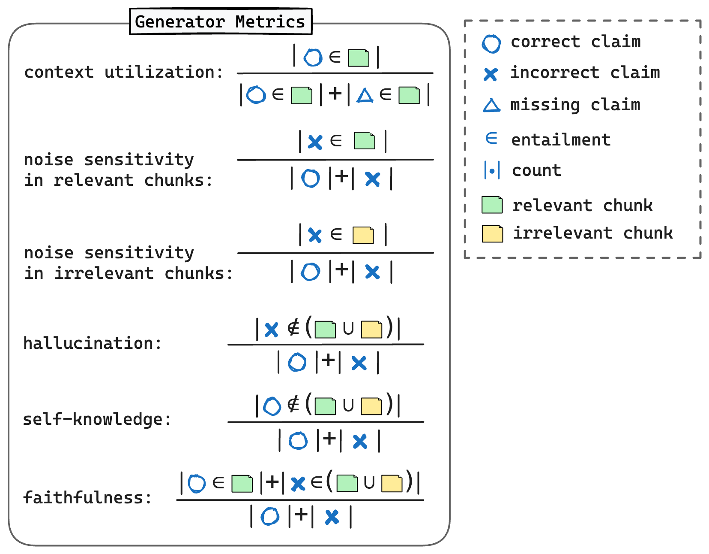

# RAGChecker教程

目录：

- [RAGChecke简介](#ragchecke简介)
- [准备测试数据和RAG输出](#准备测试数据和rag输出)
   - [测试数据](#测试数据)
   - [获取RAG的输出](#获取rag的输出)
- [RAGChecker的工作原理](#ragchecker的工作原理)
- [RAGChecker的指标](#ragchecker的指标)
   - [整体指标](#整体指标)
   - [检索指标](#检索指标)
   - [生成指标](#生成指标)
   - [RAGChecker指标总结](#ragchecker指标总结)
- [如何使用RAGChecker](#如何使用ragchecker)
   - [命令行运行RAGChecker](#命令行运行ragchecker)
   - [在Python代码中使用RAGChecker](#在python代码中使用ragchecker)
- [解读结果并改进您的RAG系统](#解读结果并改进您的rag系统)
- [FAQ](#faq)


## RAGChecke简介

RAGChecker是一个全面的评估框架，旨在评估和诊断检索增强生成（RAG）系统。RAG系统结合了信息检索（retriever，从知识库中获取相关信息）和回复生成（generator, 基于检索的信息和输入查询生成回复）。

RAGChecker帮助开发人员:

- 识别RAG系统中需要改进的地方。
- 理解检索和生成模块之间的相互作用。
- 改进系统以获得更好的性能。

## 准备测试数据和RAG输出

<p align="center">
  
  <br>
  <b>Figure</b>: RAG系统的流程
</p>

#### 测试数据

要使用RAGChecker，您需要准备一个基准数据集或测试集，由问答（QA）对组成：
- **问题（Question）**: 用户输入RAG系统的真实问题或查询。
- **标准答案（Ground Truth Answer）**: 问题的理想答案，通常由人类基于文档编写。

通常，问题来自真实用户案例。将问题答案对放入具有以下格式的JSON文件中：

```json
{
   "results": [ # A list of QA pairs
      {
         "query_id": "000",
         "query": "这是第一个例子的问题",
         "gt_answer": "这是第一个例子的标准答案"
      },
      {
         "query_id": "001",
         "query": "这是第二个例子的问题",
         "gt_answer": "这是第二个例子的标准答案"
      },
      ...
   ]
}
```


#### 获取RAG的输出

对于测试集中的每个问题，运行您的RAG系统并收集：
- **检索上下文（Retrieved Context）**: 从知识库中检索到的信息。
- **回复（Response）**: RAG系统基于问题和检索上下文生成的最终输出。

将这些输出添加到您的JSON文件中：

```json
{
   "results": [
      {
         "query_id": "000",
         "query": "这是第一个例子的问题",
         "gt_answer": "这是第一个例子的标准答案",
         "response": "这是第一个例子的RAG回复",
         "retrieved_context": [ # 检索模块返回的chunk列表
            {
               "doc_id": "xxx",
               "text": "第一个chunk的内容"
            },
            {
               "doc_id": "xxx",
               "text": "第二个chunk的内容"
            },
            ...
         ]
      },
      {
         "query_id": "001",
         "query": "这是第二个例子的问题",
         "gt_answer": "这是第二个例子的标准答案",
         "response": "这是第二个例子的RAG回复",
         "retrieved_context": [
            {
               "doc_id": "xxx",
               "text": "第一个chunk的内容"
            },
            {
               "doc_id": "xxx",
               "text": "第二个chunk的内容"
            },
            ...
         ]
      }
   ],
   ...
}
```


## RAGChecker的工作原理

RAGChecker使用`声明级检查(claim-level checking)`方法进行细粒度评估。以下是其工作原理：

1. **声明抽取（Claim Extraction）**：RAGChecker使用大型语言模型（LLM）作为抽取器，将复杂文本（RAG系统响应和标准答案）分解为单独的声明。声明是一个独立的、原子化的信息片段，可以被验证为真或假。示例：文本："埃菲尔铁塔建于1889年，高324米。"
抽取的声明：
```
("埃菲尔铁塔", "建于", "1889年")
("埃菲尔铁塔", "高度", "324米")
```

2. **声明检查（Claim Checking）**: 另一个LLM作为检查器，根据参考文本（检索的上下文或标准答案）验证每个提取的声明的准确性。

<p align="center">
  
  <br>
  <b>Figure</b>: 声明级检查
</p>

RAGChecker执行以下比较：

- 回复的声明 vs. 标准答案：衡量回复的正确性。
- 标准答案的声明 vs. 回复：衡量回复的完整性。
- 回复的声明 vs. 检索上下文：衡量忠实度并识别幻觉。
- 标准答案的声明 vs. 检索上下文：评估检索信息的质量。

这些比较是计算RAGChecker中各种指标的基础。


## RAGChecker的指标

RAGChecker提供三类指标来评估RAG系统的不同方面：

#### 整体指标

<p align="center">
  
  <br>
  <b>Figure</b>: 整体指标
</p>

这些指标衡量整个RAG流程的整体质量：

- **精度（Precision）**: 表示回复的`正确性（correctness）`（回复中正确声明的比例）。
- **召回（Recall）**: 表示回复的`完整性（completeness）`（回复中提到的标准答案声明的比例）。
- **F1**: 精确率和召回率的调和平均值，衡量回复的整体质量。

计算整体指标需要回复和标准答案，不需要检索上下文。

### 检索指标

<p align="center">
  
  <br>
  <b>Figure</b>: 检索指标
</p>

检索指标衡量检索模块（如BM25）搜索相关信息和并降低噪音的能力。

- **声明召回（Claim Recall）**：检索上下文覆盖的标准答案声明的比例。
- **上下文精度（Context Precision）**：相关chunk的比例。不相关的chunk可以被视为噪音。

>相关chunk是指包含任意标准答案声明的chunk（图中绿色方块）。

计算检索器指标需要标准答案和检索上下文。

### 生成指标

<p align="center">
  
  <br>
  <b>Figure</b>: 生成指标
</p>

生成指标可以评估生成器的多个方面性能：

- **上下文利用率（Context Utilization）**：生成器有效使用上下文中相关信息的程度。
- **噪音敏感度（Noise Sensitivity）**：生成器受相关和不相关文本块中噪音影响的程度。
- **幻觉（Hallucination）**：生成的不在上下文中的错误信息。
- **自身知识（Self-knowledge）**：使用模型自身知识而不是检索上下文中的内容。
- **忠实度（Faithfulness）**：生成器使用检索上下文的程度。


### RAGChecker指标总结

| 模块 | 指标 | 描述 | 注释 |
| --     | --     | --          | -- |
| 整体 | 精确（Precision） | 回复的正确性（correctness） |  |
|         | 召回（Recall） | 回复的完整性（completeness） |  |
|         | F1 | 回复的整体质量 |  |
| 检索 | 声明召回（Claim Recall） | 检索上下文的声明级召回率 |   |
|           | 上下文精度（Context Precision） | 检索上下文中相关chunk的比例 |  |
| 生成 | 上下文利用率（Context Utilization） | 生成器有效使用上下文中相关信息的程度 |  |
|           | 对相关chunk中的噪音敏感度（Noise Sensitivity in Relevant） | 生成器受相关chunk中噪音影响的程度 | 越低越好 |
|           | 对不相关chunk中的噪音敏感度（Noise Sensitivity in Irrelevant） | 生成器受不相关chunk中噪音影响的程度 | 越低越好 |
|           | 幻觉（Hallucination） | 生成器编造的错误信息 | 越低越好 |
|           | 自身知识（Self-knowledge） | 使用模型自身知识而不是上下文的情况 | 是否越低越好取决于用户偏好 |
|           | 忠实度（Faithfulness） | 生成器使用检索上下文的程度 |  |


## 如何使用RAGChecker

首先安装依赖：

```bash
pip install ragchecker
python -m spacy download en_core_web_sm
```


### 命令行运行RAGChecker

1. 按照所需格式准备您的输入JSON文件（参见上面的描述）。

2. 运行评估脚本（使用我们仓库中的示例文件）：
```bash
ragchecker-cli \
    --input_path=examples/checking_inputs.json \ # 这是您的输入数据
    --output_path=examples/checking_outputs.json \ # 此指定输出文件
    --extractor_name=bedrock/meta.llama3-1-70b-instruct-v1:0 \ # 关于如何设置模型，请参考下面的描述
    --checker_name=bedrock/meta.llama3-1-70b-instruct-v1:0 \ # 关于如何设置模型，请参考下面的描述
    --batch_size_extractor=64 \
    --batch_size_checker=128 \ # 可以大于batch_size_extractor
    --metrics all_metrics # all_metrics, overall_metrics, retriever_metrics 或 generator_metrics
```

> 💡 **为Extractor和Checker设置LLM**
> 
> RAGChecker使用[litellm](https://docs.litellm.ai/) 来调用LLM。请参考他们的文档了解不同的LLM提供商（如OpenAI、AWS Bedrock、AWS Sagemaker或由vllm部署）： [Supported Model & Providers](https://docs.litellm.ai/docs/providers). 
>
> 您也可以参考[RefChecker的相关指南](https://github.com/amazon-science/RefChecker/tree/main?tab=readme-ov-file#choose-models-for-the-extractor-and-checker) 来设置LLM。

### 在Python代码中使用RAGChecker

```python
from ragchecker import RAGResults, RAGChecker
from ragchecker.metrics import all_metrics


# 从json/dict初始化ragresults
with open("examples/checking_inputs.json") as fp:
    rag_results = RAGResults.from_json(fp.read())

# 设置评估器
evaluator = RAGChecker(
    extractor_name="bedrock/meta.llama3-1-70b-instruct-v1:0",
    checker_name="bedrock/meta.llama3-1-70b-instruct-v1:0",
    batch_size_extractor=32,
    batch_size_checker=32
)

# 使用选定的指标（如retriever_metrics、generator_metrics、all_metrics）评估结果
evaluator.evaluate(rag_results, all_metrics)
print(rag_results)
```

> 💡 **使用您自己的LLM进行声明抽取和检查**
> 
> 如上所述，我们使用litellm来调用LLM进行声明提取和检查。但是，有时我们想使用自己部署的与litellm不兼容的LLM，我们可以使用参数`custom_llm_api_func`来设置调用我们的LLM的函数。
>
>```python
># 定义调用您自己的LLM的函数
>def my_llm_api_func(prompts):
>    """
>    Get responses from LLM for the input prompts
>    Parameters
>    ----------
>    prompts: List[str]
>    A list of prompts.
>    
>    Returns
>    ----------
>    response_list : List[str]
>        A list of generated text.
>    """
>    # 在这里编写调用LLM的代码
>    # 将模型回复放入`response_list`
>    # 注意：为加速评估，最好使用批处理
>    
>    return response_list
>
>
># 使用自定义API函数初始化评估器
>evaluator = RAGChecker(
>    custom_llm_api_func=my_llm_api_func
>)
>```
>
>请注意，RAGChecker将调用许多请求，因此您应该在函数中实现`批量调用`。如果您的工具不能直接支持批量调用，请考虑使用[asyncio](https://docs.python.org/3/library/asyncio.html) 做并发调用。


代码成功运行后，它将输出如下所示的指标值：

```json
Results for examples/checking_outputs.json:
{
  "overall_metrics": {
    "precision": 73.3,
    "recall": 62.5,
    "f1": 67.3
  },
  "retriever_metrics": {
    "claim_recall": 61.4,
    "context_precision": 87.5
  },
  "generator_metrics": {
    "context_utilization": 87.5,
    "noise_sensitivity_in_relevant": 22.5,
    "noise_sensitivity_in_irrelevant": 0.0,
    "hallucination": 4.2,
    "self_knowledge": 25.0,
    "faithfulness": 70.8
  }
}
```


## 解读结果并改进您的RAG系统

运行RAGChecker后，您将收到一组指标。以下是如何解读这些结果并采取行动：

1. **检索模块**:
   - 声明召回率低：考虑使用更先进的检索模型或增加检索chunk的数量。
   - 上下文精确率低：尝试减少检索文本块的数量以降低噪声。

如果可能的话，您还可以考虑微调检索器。

2. **生成模块**:
   - 忠实度低或幻觉高：调整您的提示以强调仅使用检索到的信息。
   - 上下文利用率低：修改提示以鼓励生成器识别和使用相关信息。
   - 噪音敏感度高：在提示中增加推理步骤，帮助生成器忽略不相关信息。

3. **整体系统改进**:
   - 尝试不同的文本块大小和检索文本块数量。
   - 尝试不同的检索器和生成器组合。
   - 如果可能，在特定领域数据上微调两个组件。

## FAQ

**Q: RAGChecker可以用于非英语语言吗？**

A: 虽然RAGChecker设计用于英语，但如果您使用能力强的多语言LLM进行声明抽取和检查就可以直接适用于其他语言。

**Q: RAGChecker适合生产环境监控吗？**

A: 对于生产环境监控，请忠实度指标(faithfulness)，因为它不需要标准答案。

**Q: RAGChecker支持自定义指标吗？**

A: 目前，RAGChecker不支持自定义指标。考虑fork项目以添加您自己的指标，或使用独立工具进行额外评估。